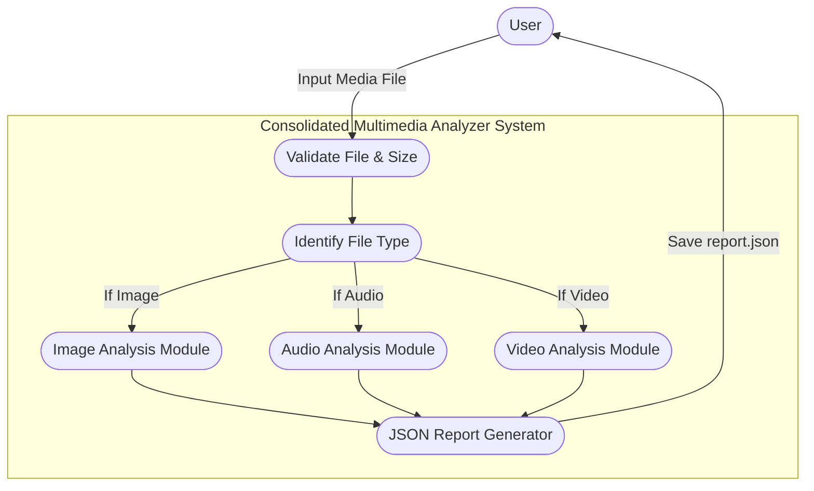

# Final Project: Consolidated Multimedia Analyzer

This is the final consolidated project that accepts any multimedia file (Image, Audio, Video), automatically identifies its type, analyzes it using the appropriate module, and generates a structured JSON report.

## Project Structure
- `main.py`: Entry point for the application.
- `file_utils.py`: Contains utilities for file validation, size extraction, and type identification.
- `image_analyzer.py`: Module for analyzing images.
- `audio_analyzer.py`: Module for analyzing audio files.
- `video_analyzer.py`: Module for analyzing video files.
- `report_generator.py`: Module for exporting the analysis results to a JSON report.
- `samples/`: Directory for sample media files.
- `reports/`: Output directory for generated reports.

## Usage
```bash
python main.py <path_to_media_file>
```

## Requirements
- Python 3
- Pillow (`pip install Pillow`)
- Mutagen (`pip install mutagen`)
- FFmpeg/ffprobe installed on the system

## System Architecture / Use Case

