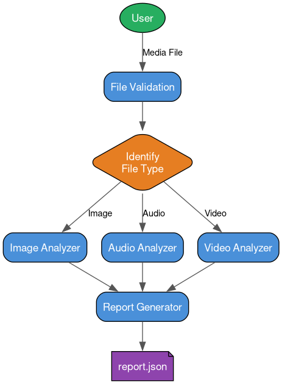

# Final Project — Consolidated Multimedia Analyzer

Accepts any media file (Image, Audio, Video), auto-detects the type, routes it to the correct analyzer module, and produces a structured JSON report.

## Project Structure
```
multimedia_analyzer/
├── main.py
├── file_utils.py
├── image_analyzer.py
├── audio_analyzer.py
├── video_analyzer.py
├── report_generator.py
├── samples/
│   ├── sample.jpg
│   ├── sample.mp3
│   └── sample.mp4
└── reports/
    └── report.json
```

## Usage
```bash
python main.py samples/sample.jpg
python main.py samples/sample.mp3
python main.py samples/sample.mp4
```

## Requirements
```
pip install Pillow mutagen
# Also: FFmpeg installed on system
```

## Sample Files

### Image


### Audio
▶️ [sample.mp3](samples/sample.mp3)

### Video
▶️ [sample.mp4](samples/sample.mp4)

## System Architecture



## Sample Report Output
```json
{
    "File Type Identified": "VIDEO",
    "File Name": "sample.mp4",
    "File Size": "0.75 MB",
    "Container": "QuickTime / MOV",
    "Duration": "10.03 seconds",
    "Video": {
        "Resolution": "320x176",
        "Frame Rate": "25/1",
        "Bit Rate": "300 kbps",
        "Codec": "h264"
    },
    "Audio": {
        "Codec": "aac",
        "Channels": "2",
        "Sampling Rate": "48000 Hz",
        "Bit Rate": "160 kbps"
    },
    "Metadata": {
        "major_brand": "mp42",
        "creation_time": "2012-03-13T08:58:06.000000Z",
        "encoder": "HandBrake 0.9.6 2012022800"
    }
}
```
